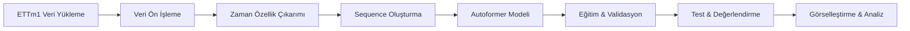

# Autoformer ile Zaman Serisi Tahmini (ETTm1 Veri Seti)

Bu proje, uzun vadeli zaman serisi tahmini için geliştirilmiş Autoformer (Auto-Correlation Transformer) modelini ETTm1 (Electricity Transforming Temperature) veri seti üzerinde uygulayarak çok değişkenli zaman serisi tahmini gerçekleştirmektedir. Proje, modern transformer mimarilerinin zaman serisi analizi alanındaki potansiyelini göstermeyi ve comprehensive bir analiz sunmayı amaçlar.

## 📋 İçindekiler

- [Proje Hakkında](#proje-hakkında)
- [Amaç ve Kapsam](#amaç-ve-kapsam)
- [Veri Seti](#veri-seti)
- [Metodoloji](#metodoloji)
- [Model Mimarisi](#model-mimarisi)
- [Kurulum ve Kullanım](#kurulum-ve-kullanım)
- [Sonuçlar ve Performans](#sonuçlar-ve-performans)
- [Görselleştirmeler](#görselleştirmeler)
- [Katkıda Bulunma](#katkıda-bulunma)

## 🚀 Proje Hakkında

Bu çalışma, Autoformer modelinin temel bileşenlerini (ayrıştırma blokları, otomatik korelasyon mekanizması) kullanarak elektrik transformatör sıcaklık ve yük verilerini analiz eder. **96 zaman adımı** geçmiş veriyi kullanarak **96 zaman adımı** gelecek tahmini gerçekleştiren model, çok değişkenli (multivariate) yaklaşımla 7 farklı özelliği eş zamanlı olarak tahmin eder.

### 🎯 Amaç ve Kapsam

- **Ana Hedef**: 'OT' (Oil Temperature - Yağ Sıcaklığı) ve diğer özellikleri çok değişkenli yaklaşımla tahmin
- **Teknik Amaç**: Transformer mimarilerinin zaman serisi verilerindeki potansiyelini gösterme
- **Akademik Katkı**: Autoformer'ın auto-correlation mekanizmasını praktik uygulamada test etme
- **Metodolojik Değer**: Kapsamlı veri ön işleme, modelleme, eğitim ve değerlendirme pipeline'ı sunma

## 📊 Veri Seti: ETTm1 (Electricity Transformer Temperature)

### Veri Seti Özellikleri
- **Kaynak**: [ETDataset Repository](https://github.com/zhouhaoyi/ETDataset)
- **Zaman Aralığı**: 2016-07-01 ile 2018-06-26 (69,680 zaman adımı)
- **Çözünürlük**: 15 dakikalık ölçümler
- **Format**: CSV dosyası, eksik değer yok

### Değişkenler
| Değişken | Açıklama | Tür |
|----------|----------|-----|
| `date` | Zaman damgası | Datetime |
| `HUFL` | High Useful Load (Yüksek Faydalı Yük) | Covariate |
| `HULL` | High Useless Load (Yüksek Faydasız Yük) | Covariate |
| `MUFL` | Medium Useful Load (Orta Faydalı Yük) | Covariate |
| `MULL` | Medium Useless Load (Orta Faydasız Yük) | Covariate |
| `LUFL` | Low Useful Load (Düşük Faydalı Yük) | Covariate |
| `LULL` | Low Useless Load (Düşük Faydasız Yük) | Covariate |
| `OT` | Oil Temperature (Yağ Sıcaklığı) | **Ana Hedef** |

### Veri Bölümü Stratejisi
```
📊 Toplam: 69,680 örnek
├── 🎯 Eğitim (Train): 60% → 41,808 örnek
├── ✅ Doğrulama (Validation): 20% → 13,936 örnek  
└── 🧪 Test: 20% → 13,936 örnek
```

## 🛠 Metodoloji

### 3.1 Veri Ön İşleme Pipeline'ı
```python
# 1. Zaman İndeksi Dönüşümü
df['date'] = pd.to_datetime(df['date'])
df.set_index('date', inplace=True)

# 2. Standardizasyon
scaler = StandardScaler()
scaled_data = scaler.fit_transform(train_data)

# 3. Zaman Özellik Çıkarımı (5 özellik)
time_features = time_features(df.index, freq='t')

# 4. Sequence Oluşturma
seq_len = 96      # Girdi dizisi uzunluğu (1 gün)
label_len = 48    # Decoder başlangıç token
pred_len = 96     # Tahmin ufku (1 gün)
```

### 3.2 Autoformer Girdi Formatı
Model için 5 farklı dizi türü oluşturulur:
- **X_enc**: (samples, 96, 7) - Encoder ana girdisi
- **X_mark_enc**: (samples, 96, 5) - Encoder zaman özellikleri  
- **X_dec**: (samples, 144, 7) - Decoder girdisi (48 geçmiş + 96 sıfır)
- **X_mark_dec**: (samples, 144, 5) - Decoder zaman özellikleri
- **Y_true**: (samples, 96, 7) - Hedef değerler

## 🏗 Model Mimarisi

### Autoformer Konfigürasyonu
```python
Model Hiperparametreleri:
├── Sequence Length: 96 (1 gün geçmiş)
├── Prediction Length: 96 (1 gün tahmin)  
├── Model Dimension: 512
├── Attention Heads: 8
├── Encoder Layers: 2
├── Decoder Layers: 1
├── Feed Forward: 2048
├── Auto-correlation Factor: 3
├── Moving Average Window: 25
├── Dropout: 0.05
└── Toplam Parametreler: ~10.5M
```

### Auto-Correlation Mekanizması
- **Geleneksel Self-Attention Alternatifi**: O(L log L) karmaşıklık
- **Periyodik Örüntü Yakalama**: Zaman serisi için optimize edilmiş
- **Trend-Seasonality Ayrıştırması**: Moving average ile decomposition

## 🛠 Kurulum ve Kullanım

### Sistem Gereksinimleri
```
🐍 Python: 3.11.12
🔥 PyTorch: 2.6.0+cu124  
🤗 Transformers: 4.48.3
📊 NumPy: 2.0.2
📈 Pandas: 2.2.2
⚡ CUDA: Desteklenen GPU (önerilen)
```

### Hızlı Başlangıç
```bash
# 1. Repository'yi klonlayın
git clone https://github.com/kullaniciadi/autoformer-zaman-serisi-tahmini.git

# 2. Google Colab'da açın ve sırasıyla çalıştırın:
```

### Adım Adım Çalıştırma
1. **Hücre 1**: Kütüphane kurulumu → Runtime yeniden başlat
2. **Hücre 2**: Kütüphane import ve sürüm kontrolü
3. **Hücre 3**: ETTm1 veri seti yükleme ve keşif
4. **Hücre 4**: Veri ön işleme ve sequence oluşturma
5. **Hücre 5**: Autoformer kaynak kod entegrasyonu
6. **Hücre 6**: Model tanımlama ve konfigürasyon
7. **Hücre 6a**: Gelişmiş veri hazırlığı
8. **Hücre 7**: Model eğitimi (10 epoch)
9. **Hücre 8-11**: Test, değerlendirme ve görselleştirme

## 📈 Sonuçlar ve Performans

### Eğitim Performansı
| Epoch | Train Loss | Val Loss | Val MAE | Val RMSE | Val R² |
|-------|------------|----------|---------|----------|--------|
| 1 | 0.3248 | 0.4466 | 0.4617 | 0.6678 | 0.4569 |
| 5 | 0.1421 | 0.3832 | 0.4235 | 0.6190 | 0.5106 |
| **10** | **0.0854** | **0.3684** | **0.4177** | **0.6064** | **0.5240** |

### Test Seti Performansı (Geri Ölçeklendirilmiş)
```
🎯 Test Seti Metrikleri ('OT' Özelliği):
├── MSE: 5.830495
├── MAE: 1.917781  
├── RMSE: 2.414642
├── R²: 0.505747 (Varyansın %50.5'ini açıklıyor)
└── MAPE: Güvenilir değil (sıfıra yakın değerler nedeniyle)
```

### Performans Analizi
- ✅ **R² ≈ 0.51**: Model test verisindeki varyansın %51'ini açıklıyor
- ✅ **Trend Yakalama**: Genel eğilimleri başarıyla modelliyor
- ✅ **Erken Durdurma**: 10. epoch'ta en iyi performans
- ⚠️ **MAPE Problemi**: Sıfıra yakın gerçek değerler nedeniyle güvenilir değil

### Süre Performansı
```
⏱️ Performans Metrikleri:
├── Toplam Eğitim Süresi: 19.47 dakika
├── Çıkarım Hızı: 0.001176 saniye/pencere
└── İşlem Kapasitesi: 850.68 pencere/saniye
```

## 📊 Görselleştirmeler

### 1. Eğitim İzleme Grafikleri
- **Kayıp Grafikleri**: Epoch bazında train/validation loss tracking
- **Metrik Evolüsyonu**: MAE, RMSE, R² gelişim grafikleri
- **Convergence Analizi**: Model yakınsama durumu

### 2. Tahmin Kalitesi Analizi  
- **Gerçek vs Tahmin**: Zaman serisi overlay grafikleri
- **Hata Dağılımı**: Residual histogram ve density plots
- **Scatter Plot**: Predicted vs actual değerler

### 3. İstatistiksel Validasyon
- **ACF/PACF**: Residual'ların otokorelasyon analizi  
- **Residual Plot**: Sistematik hata kontrolü
- **Error Distribution**: Hata dağılımının normallik testi

## 🔄 Proje Workflow



## 🎓 Akademik Katkılar

### Teknik İnovasyonlar
- **Auto-Correlation Mechanism**: Zaman serisi için optimize edilmiş attention
- **Decomposition Architecture**: Trend-seasonal pattern ayrıştırması
- **Multivariate Forecasting**: 7 özellik eş zamanlı tahmini

### Metodolojik Değer
- **Comprehensive Pipeline**: End-to-end zaman serisi analizi
- **Robust Evaluation**: Çoklu metrik değerlendirmesi  
- **Reproducible Research**: Detaylı dokümantasyon ve kod

## 📁 Proje Yapısı

```
autoformer-zaman-serisi-tahmini/
│
├── 📓 Autoformer_ile_Zaman_Serisi_Tahmini.ipynb
├── 📖 README.md
├── 📊 data/
│   └── ETTm1.csv (otomatik indirilir)
├── 🔧 autoformer_official_code/ (otomatik klonlanır)
├── 💾 models/
│   └── autoformer_best_model_v2.pth
└── 📈 results/
    ├── training_plots/
    ├── prediction_plots/
    └── performance_metrics/
```

## 🤝 Katkıda Bulunma

### Geliştirme Alanları
- [ ] Farklı sequence length'leri ile deneyim
- [ ] Diğer ETT veri setleri (ETTh1, ETTh2, ETTm2) ile test
- [ ] Hyperparameter optimization
- [ ] Model ensemble teknikleri
- [ ] Real-time prediction pipeline

### Katkı Süreci
1. Fork the repository
2. Create feature branch (`git checkout -b feature/yeni-ozellik`)
3. Commit changes (`git commit -am 'Yeni özellik: XYZ'`)
4. Push to branch (`git push origin feature/yeni-ozellik`)
5. Create Pull Request

## 📚 Referanslar

1. **Wu, H., Xu, J., Wang, J., & Long, M.** (2021). Autoformer: Decomposition transformers with auto-correlation for long-term series forecasting. *Advances in Neural Information Processing Systems*, 34.

2. **Zhou, H., Zhang, S., Peng, J., Zhang, S., Li, J., Xiong, H., & Zhang, W.** (2021). Informer: Beyond efficient transformer for long sequence time-series forecasting. *AAAI 2021*.

3. **ETDataset Repository**: https://github.com/zhouhaoyi/ETDataset

## 🙏 Teşekkürler

- **THUML Research Group**: Orijinal Autoformer implementasyonu
- **ETDataset Contributors**: Açık kaynak veri seti
- **PyTorch Team**: Deep learning framework
- **Google Colab**: Ücretsiz GPU kaynaklarıa

## 📜 Lisans

Bu proje MIT lisansı altında lisanslanmıştır. Detaylar için `LICENSE` dosyasına bakınız.

## 📞 İletişim

🐛 **Bug Report**: GitHub Issues kullanın  
💡 **Feature Request**: Discussions bölümünden önerinizi paylaşın  
📧 **İletişim**: Repository sahibi ile iletişime geçin
- E-posta: [mehmetaksoy49@gmail.com]


---

⭐ **Bu projeyi beğendiyseniz star vermeyi unutmayın!**

*Son güncelleme: Aralık 2024*
